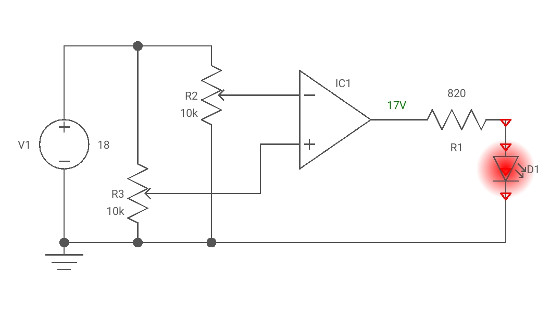

### Introduction
 

The Op-amp comparator compares one analogue voltage level with another analogue voltage level, or some preset reference voltage, VREF and produces an output signal based on this voltage comparison. In other words, the op-amp voltage comparator compares the magnitudes of two voltage inputs and determines which is the largest of the two.
                        
 
Voltage comparators either use positive feedback or no feedback at all (open-loop mode) to switch its output between two saturated states, because in the open-loop mode the amplifiers voltage gain is basically equal to AVO. Then due to this high open loop gain, the output from the comparator swings either fully to its positive supply rail, +Vcc or fully to its negative supply rail, -Vcc on the application of varying input signal which passes some preset threshold value.                          

<b>Vin > Vref -> Vout = Vout+ Vsat  </b>

<b>Vin < Vref -> Vout = Vout- Vsat</b>
 

 
With reference to the op-amp comparator circuit above, lets first assume that VIN is less than the DC voltage level at VREF, ( VIN < VREF ). As the non-inverting (positive) input of the comparator is less than the inverting (negative) input, the output will be LOW and at the negative supply voltage, -Vcc resulting in a negative saturation of the output. 
If we now increase the input voltage, VIN so that its value is greater than the reference voltage VREF on the inverting input, the output voltage rapidly switches HIGH towards the positive supply voltage, +Vcc resulting in a positive saturation of the output. If we reduce again the input voltage VIN, so that it is slightly less than the reference voltage, the op-amp’s output switches back to its negative saturation voltage acting as a threshold detector.                          

 
Then we can see that the op-amp voltage comparator is a device whose output is dependant on the value of the input voltage, VIN with respect to some DC voltage level as the output is HIGH when the voltage on the non-inverting input is greater than the voltage on the inverting input, and LOW when the non-inverting input is less than the inverting input voltage. This condition is true regardless of whether the input signal is connected to the inverting or the non-inverting input of the comparator.

   

 

<b>Figure 1. Voltage Comaparator</b>

